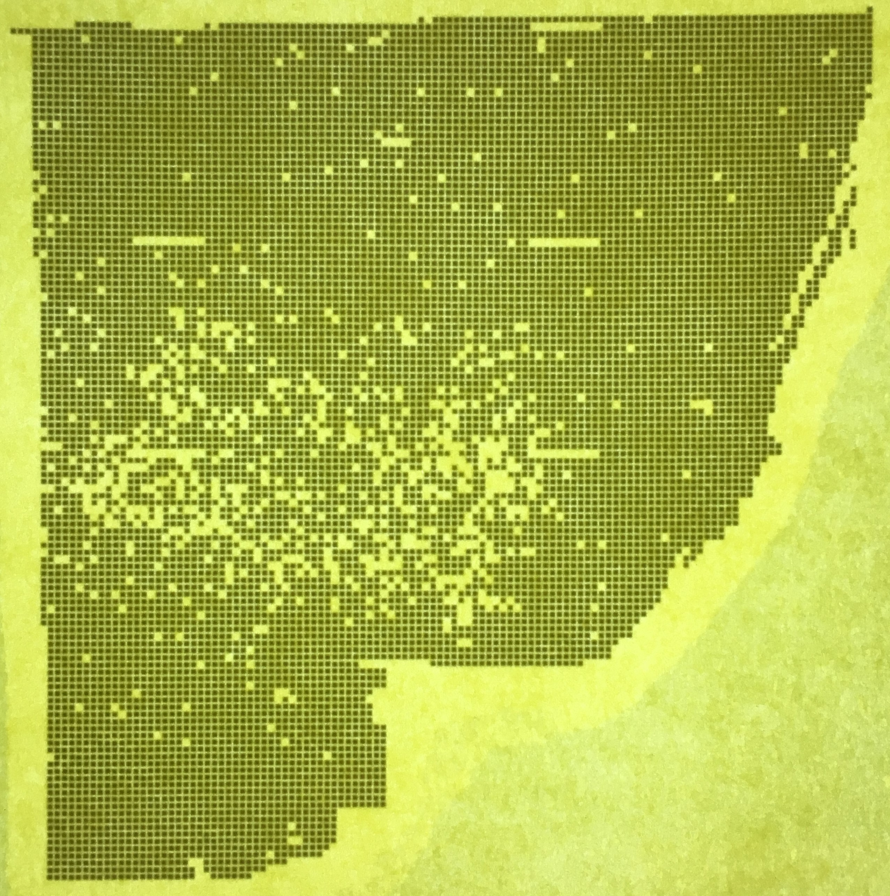

Side Project - Wafer Image to Wafer Map Converter 
=======================================
## waferImage2waferMap
waferImage2wafermap repository converts the image of wafer semiconductor into the wafer map to be used in a factory line.
A wafer, also called a slice or substrate, is a thin slice of semiconductor material, such as a crystalline silicon, used in electronics for the fabrication of integrated circuits and in photovoltaics for conventional, wafer-based solar cells.(Wikipedia). 

## Requirements
- Accessing the wafer images
- This project is used in Eclipse IDE with JAVA programming language.
- Use SINF format for conversion method.
- Use image processing technique to read the image.
- Atleaset 2 System Tests, 2 Integration Tests and 5 Unit Tests are required.

## Design

This project should read the image and convert it to the SINF format. Image processing technique should be designed and applied for conversion quality. 

### SINF Format 

```java
DEVICE:xxx    identification assigned by the originator
LOT:xxx       identification assigned by the originator
WAFER:xxx     identification assigned by the originator
FNLOC:180     wafer flat position (0=TOP,90=RIGHT,180=BOT 270=LEFT)
ROWCT:62      number of rows
COLCT:63      number of columns
BCEQU:01      List of Bin Codes that are a good die
REFPX:        x-coord of reference die (optional)
REFPY:        y-coord of reference die (optional)
DUTMS:mm      die units of measurement (mm or mil)
XDIES:2.945   step along X
YDIES:2.945   step along Y
```
## Image Definition
Wafer image is RGB color space. RGB color space or RGB color system, constructs all the colors from the combination of the Red, Green and Blue colors.
The red, green and blue use 8 bits each, which have integer values from 0 to 255. This makes 256*256*256=16777216 possible colors. See [Image Defination](https://www.rapidtables.com/web/color/RGB_Color.html). 


### Image Contrast 
Contrast is the difference in luminance or color that makes an object (or its representation in an image or display) distinguishable. In visual perception of the real world, contrast is determined by the difference in the color and brightness of the object and other objects within the same field of view. (Wikipedia). Brightness and contrast factors are significant factors that could result in failing or passing the ASIC processor component from the image. These factors is set in the configuration file and with the same test environment no tuning is required. It is recommended to switch off the flash light while taking photo from the wafer.  

### Edge Detection Filter 
Edge detection filter defines a complete die mask and considers it as healthy die. Then it tries to find a matching chip die size by applying edge detection technique. Fatal die processor can be detected by detecting faulty edge less than a certain threshold and the algorithm will ignore the NOK die in the mass production in the factory line. For this purpose, image processing tool is designed and implemented.

- RGB Maker
- Pattern Detector
- Similarity Pattern
- Die Measurement

### Noise Removal Filter 
Noise removal filter tries to detect background noise from the image and remove it from the whole process. Convert the image to black and white scale image and normalize the image are the part of noise removal filter.The list of image processing units used in this project, are listed here:

- Black and White scaled image 
- Normalized Image 
- Crop Filter 

## Test 
This project requires test cases execute through JUnit.

```java
package cs601;

import org.junit.runner.RunWith;
import org.junit.runners.Suite;
import org.junit.runners.Suite.SuiteClasses;

@RunWith(Suite.class)
@SuiteClasses({ IntegrationTest.class, SystemTest.class, UnitTest.class })

public class AllTests {

}
```

## Expected Result
The output file contains converted SINF format file to be read from CNC machine in the factory line. 
### Input Image File:


### Output SINF File: 

